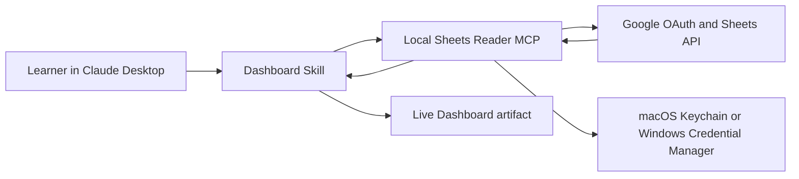

# Architecture

The Sheets Reader is deliberately generic. It authenticates, validates a target, and returns bounded Sheet data. Business interpretation belongs in a separate Dashboard Skill so the same MCP can support other Sheets use cases.

## Responsibility split

- **MCPB:** learner-owned OAuth, spreadsheet reference parsing, read-only API calls, bounded stable results, and safe errors.
- **Dashboard Skill:** inspect a sample, infer suitable KPIs and charts, explain data-quality issues, and render the dashboard with the approved local tools.
- **Live artifact:** a snapshot in the Claude conversation. Refresh is manual through the native **Reload** control, not a background real-time subscription.

The manual refresh sequence is: the learner presses **Reload** in the Live Artifact header, the page loads again, and the same bounded MCP tools read the latest Sheet values. The dashboard keeps the last successful view if a read or schema check fails.

## Trust boundaries

The OAuth loopback listener binds to the learner's computer for the duration of connection. Tokens go to the operating-system vault. No course server receives Google credentials or Sheet data. Selected tool results do enter the Claude conversation, as described in [Privacy](privacy.md).

## Stable tools

The Dashboard Skill depends only on the five manifest-declared tool names and their stable structured result envelopes. This keeps the MCP reusable while allowing course-specific dashboard behavior to evolve independently.
